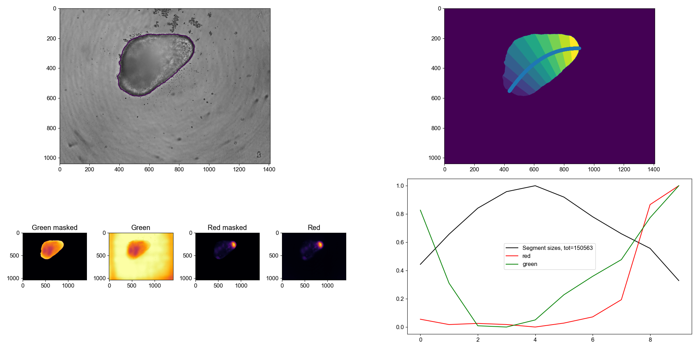

# HTH_GasSeg

Thomas Combriat, HTH, UiO, 2026

## Morphological evaluation of gastruloids.

GasSeg is a small program to compute some shape estimators of gastruloids from brightfields images. It is also capable of computing the fluorescence spatial repartition.

### Procedure

The gastruloid is first segmented, usually using a combination of machine learning and [SAM](https://segment-anything.metademolab.com/). The algorithm expects only one gastruloid per image, and will only segment the biggest one if several objects are present. Images for which the segmented objects touches any edges of the image are considered invalid.

The midline of the object is then computed using an algorithm from [MOrgAna](https://github.com/LabTrivedi/MOrgAna), and the object is divided into a number of segment (10 by default) alongside the midline.

The size of each of these segments is computed alongside the fluorescence intensities if some fluorescence images are present.

### File list

Informations on how to run the different scripts are given at the top of the files. A brief description

 - `analyse_img_in_folder.py`: main script. Computes the morphological features and fluorescence intensities of the images.
 - `train_Segmenter.py`: can be used to train a new ML segmenter on different images.
 - `src/Segmenter.py`: the class file for the Segmentation objects.
 - `src/midline.py`: utility file for extracting the midline of a segmented object.
 - `src/ellipsis.py`: utility file for extracting the ellipsis parameter and long axis of a segmented object.
 - `trained_models/`: folder containing some ML trained models that can be used by `analyse_img_in_folder.py`.
 
 
### Output examples

The script outputs both a global text file that contains the results and which is placed in a folder `results` alongside the data:

|#File|Area|MidLineLength|Seg0\_Area|MeanRed|MeanGreen|Seg1\_Area|MeanRed|MeanGreen|Seg2\_Area|MeanRed|MeanGreen|Seg3\_Area|MeanRed|MeanGreen|Seg4\_Area|MeanRed|MeanGreen|Seg5\_Area|MeanRed|MeanGreen|Seg6\_Area|MeanRed|MeanGreen|Seg7\_Area|MeanRed|MeanGreen|Seg8\_Area|MeanRed|MeanGreen|Seg9\_Area|MeanRed|MeanGreen|
|---|---|---|---|---|---|---|---|---|---|---|---|---|---|---|---|---|---|---|---|---|---|---|---|---|---|---|---|---|---|---|---|---|
|VID9152_A1_1_2024y09m14d_16h49m.tif|514691|845.128945|0|0.000000|0.000000|86232|0.000000|0.000000|56256|0.000000|0.000000|60919|0.000000|0.000000|63416|0.000000|0.000000|0|0.000000|0.000000|127374|0.000000|0.000000|0|0.000000|0.000000|103029|0.000000|0.000000|16277|0.000000|0.000000|
|VID9152_A3_1_2024y09m14d_16h49m.tif|324919|872.698925|22566|0.000000|0.000000|31994|0.000000|0.000000|49236|0.000000|0.000000|52750|0.000000|0.000000|42570|0.000000|0.000000|35679|0.000000|0.000000|30334|0.000000|0.000000|25252|0.000000|0.000000|21259|0.000000|0.000000|13279|0.000000|0.000000|

It also outputs some images that can be used to visually assess the performances of the algorithms. These images are places in a subfolder `masks` alongside the data.

